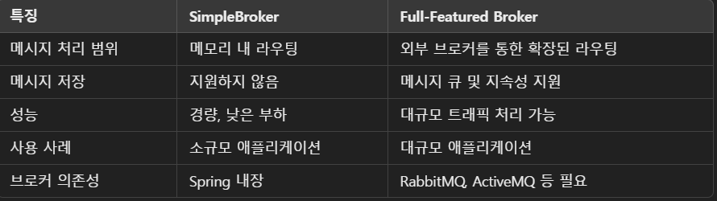

## 웹소켓 설정

### STOMP 방식
- STOMP는 메시징 프로토콜로, 웹소켓 위에서 동작하며 브로커를 통한 메시지 라우팅을 지원한다.
- 메시지 라우팅 방식
  - 클라이언트가 특정 **대상(destination)**으로 메시지를 보낸다.
  - 메시지가 브로커를 통해 적절한 대상(구독자)으로 전달된다.
```java
@Configuration
@EnableWebSocketMessageBroker
public class WebSocketConfig implements WebSocketMessageBrokerConfigurer {

    @Override
    public void configureMessageBroker(MessageBrokerRegistry registry) {
        // 클라이언트는 설정된 접두사가 붙은 경로로 메시지를 전송한다. -> /app/**
        // 클라이언트가 /app/** 로 메시지를 전송하게 되면 컨트롤러의 @MessageMapping에 의해 처리된다.
        registry.setApplicationDestinationPrefixes("/app");

        // 브로커는 클라이언트가 구독한 경로 (/queue 또는 /topic)에 메시지를 전달한다.
        // 클라이언트는 이 경로를 미리 구독해야 한다.
        // @SendTo 에 의해 처리된다.
        registry.enableSimpleBroker("/queue", "/topic");
    }

    @Override
    public void registerStompEndpoints(StompEndpointRegistry registry) {
        registry.addEndpoint("/gs-guide-websocket");
    }
}
```
### 메시지 브로커
1. **SimpleBroker**
- enableSimpleBroker()를 사용하면, Spring 내부에 내장된 SimpleBroker를 활성화한다.
  - 기본적인 메모리 기반 메시지 라우팅 기능만 제공한다.
- 가벼운 메시징 브로커로, 적은 부하와 단순 메시징 처리에 적합하다.
```java
@Override
public void configureMessageBroker(MessageBrokerRegistry registry) {
    registry.enableSimpleBroker("/queue", "/topic"); // 내장 브로커 활성화
    registry.setApplicationDestinationPrefixes("/app");
}
```

2. **Full-Featured Broker**
- enableStompBrokerRelay()를 사용하면 외부의 STOMP 브로커와 통합할 수 있다. 
- RabbitMQ나 ActiveMQ, Kafka 같은 메시지 브로커를 사용할 수 있다.
- 확장성과 신뢰성이 높으며, 외부 브로커가 메시지 저장, 라우팅, 큐 관리 등의 기능을 수행
- 대규모 애플리케이션에 적합하다.
```java
@Override
public void configureMessageBroker(MessageBrokerRegistry registry) {
    registry.setApplicationDestinationPrefixes("/app"); // 클라이언트가 메시지를 보낼 경로
    registry.enableStompBrokerRelay("/queue", "/topic") // 외부 브로커와 연결
            .setRelayHost("localhost") // RabbitMQ 또는 ActiveMQ 호스트
            .setRelayPort(61613)       // STOMP 프로토콜 포트
            .setClientLogin("guest")  // 브로커 로그인 ID
            .setClientPasscode("guest"); // 브로커 로그인 비밀번호
}
```

